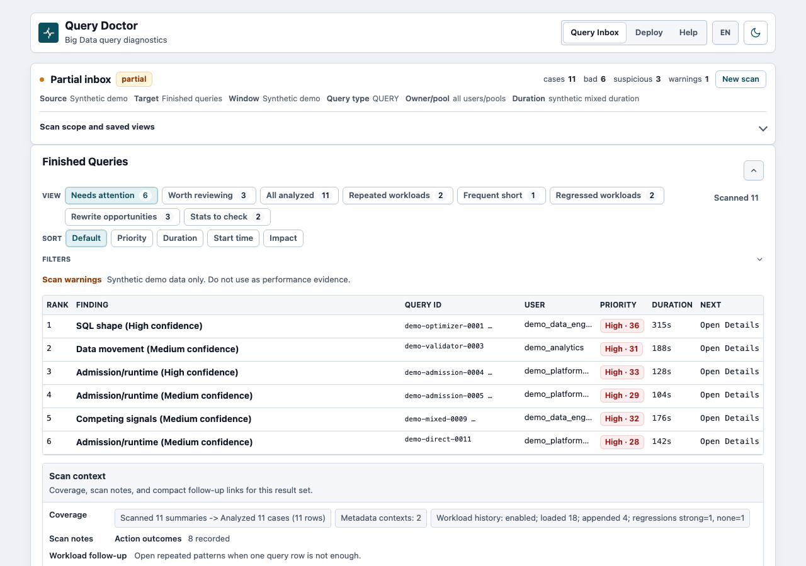
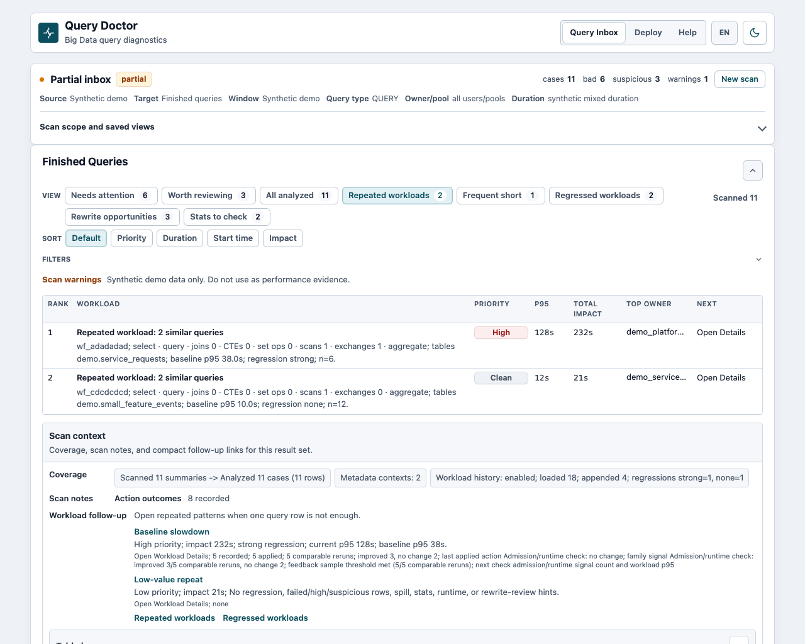

# Query Doctor

Last reviewed: 2026-08-11

Language: English | [Russian](README.ru.md)

[](https://github.com/alexandrefimov/Query-Doctor/actions/workflows/ci.yml)
[](https://github.com/alexandrefimov/Query-Doctor/actions/workflows/codeql.yml)
[](https://pypi.org/project/query-doctor/)

Find the Apache Impala queries worth investigating, and get a deterministic
answer about what to inspect and what to change — without your SQL or profiles
leaving the machine.

Query Doctor ranks suspicious Recent queries, collects bounded profile context,
derives evidence with plain Python rules, and generates validated reports. No
raw SQL and no raw profile text reaches the browser, the reports, or any remote
service.

```text
Python owns facts. LLM owns wording only.
```

## Try It

**[Analyze a profile in your browser](https://alexandrefimov.github.io/query-doctor/)**
— drop an exported Impala text profile and get the diagnosis. Nothing installs
and nothing uploads: the analyzer runs in your browser through WebAssembly, and
the page makes no request to any host after it loads.

Locally, with no cluster, config, or credentials — synthetic data only:

```bash
python -m pip install query-doctor
query-doctor-web --public-demo
```

Installing pulls zero third-party dependencies and takes a few seconds. The demo
is deterministic, local-only, read-only, and blocks every write action.





## Diagnose A Real Query

If you can export one Impala text profile from the Impala Web UI, that is the
whole setup — no Cloudera Manager, Kerberos, metadata, Prometheus, or LLM:

```bash
query-doctor-analyze --profile-text ./your-profile.txt --out cases/cm-corpus
query-doctor-web --corpus-dir cases/cm-corpus
```

A direct Impala Web UI download named `profile_<query-id-high>_<query-id-low>`
works as-is. Local and private web sessions can also upload one exported profile
from the Query Inbox page.

Four entry paths, depending on the access you have:

| Door | Use when |
| --- | --- |
| One exported profile | You can get a text profile but cannot grant live access yet. |
| Synthetic demo | You want a read-only click-through with no real data. |
| Minimal CM scan | You have read-only Cloudera Manager access for an Impala service. |
| Direct Impala scan | You can reach the debug Web UI endpoints of Kubernetes Impala coordinators. |

Full setup, options, and troubleshooting for each: [docs/first-path.md](docs/first-path.md).

## Install

```bash
python3 -m venv .venv
. .venv/bin/activate
python -m pip install --upgrade pip
python -m pip install query-doctor
query-doctor-self-test
```

`query-doctor-self-test` is the installed-package confidence check. It exercises
the packaged console scripts, one-profile analysis, local web rendering,
deterministic reports, direct Impala Recent/Running query-list parsing, a
raw-free SQLite history reopen, and the corpus smoke path against synthetic
data. It does not contact Cloudera Manager, impalad, Spark, Trino, Prometheus,
Ollama, or any external LLM service.

Local JSON configuration is documented in
[docs/configuration.md](docs/configuration.md). The preferred workstation path is
`~/.qdcreds/query-doctor-config.json`, with secrets in environment variables or
local env files. Start from `query-doctor-config.minimal.example.json` for a
Cloudera Manager workflow; `query-doctor-config.example.json` adds the advanced
direct-Impala, Prometheus, metadata, and LLM fields.
`query-doctor-config.direct-impala.example.json` covers a direct Impala cluster
without Cloudera Manager.

For development from a checkout:

```bash
python -m pip install -e ".[dev]"
pre-commit install
```

## Main Commands

| Command | What it does |
| --- | --- |
| `query-doctor-web` | Local browser UI: Recent scan, Running now, one Known Query ID, Details, explicit report and optimizer actions |
| `query-doctor-analyze` | Deterministic analyzer over one staged exported profile or collected case files |
| `query-doctor-batch-recent` | Headless bounded Recent scan and ranking |
| `query-doctor-report` | Validated report generation from Python-owned facts |
| `query-doctor-optimize-query` | Read-only review of pasted SQL |
| `query-doctor-self-test` | Installed-package confidence check over synthetic data |

Every packaged console script accepts `--help`. From an uninstalled checkout,
use `python -m query_doctor.cli.<command_module>`.

## Container And Kubernetes

```bash
docker run --rm -p 127.0.0.1:8765:8765 ghcr.io/alexandrefimov/query-doctor:0.11.0
```

The image defaults to the safe synthetic public demo. It runs on Python 3.13 and
carries the Kerberos client tools used by configured metadata collection. Build
it with `QUERY_DOCTOR_INSTALL_EXTRAS=impala` to include the HiveServer2 driver
that metadata collection needs.

Kubernetes manifests, probes, resource baselines, Recent history storage, and
the Helm chart are documented in
[deploy/kubernetes/README.md](deploy/kubernetes/README.md),
[deploy/helm/query-doctor/README.md](deploy/helm/query-doctor/README.md), and
[docs/recent-history-store.md](docs/recent-history-store.md). Shared deployments
require a trusted ingress/auth proxy; Kubernetes support adds no native auth,
RBAC, sessions, or tenant isolation inside Query Doctor.

## Safety

- Deterministic Python analysis is the only trusted source of diagnostic facts.
  LLM output is untrusted until normalized, sanitized, and validated.
- Trusted browser and report surfaces never show raw SQL, raw profiles, raw
  metadata, local paths, secrets, subprocess output, or raw artifact filenames.
  The isolated owner-only source view is the one narrow, gated exception.
- External collection is explicit, bounded, read-only, and redacted by default.
  Query Doctor never executes user SQL or optimizer draft SQL.

`privacy_mode` defaults to `true`; `no_llm=true` keeps reports and optimizer
output on deterministic Python facts alone. Full contract:
[docs/safety-contract.md](docs/safety-contract.md). Reviewer-oriented overview:
[docs/security-model.md](docs/security-model.md).

## Scope

Apache Impala is the full production triage engine. Trino has bounded local
production support for retained-list Recent, one Query ID, raw-free Details,
deterministic reports, and optimizer guidance. Spark has compact support
surfaces only, and is not production engine support.

The complete surface-by-surface contract, including what is deliberately out of
scope, is in [docs/support-boundary.md](docs/support-boundary.md).

Query Doctor is supported as a single-user, local-first tool. Do not deploy
ordinary local mode as a shared service without the separate design described in
that document.

## Documentation

Start with [docs/README.md](docs/README.md), which separates user docs,
operations guides, architecture contracts, and references. High-value next
reads: [docs/first-path.md](docs/first-path.md),
[docs/demo-mode.md](docs/demo-mode.md),
[docs/configuration.md](docs/configuration.md),
[docs/credentials.md](docs/credentials.md),
[docs/roadmap.md](docs/roadmap.md).

The canonical documentation language is English. The Russian layer is
[README.ru.md](README.ru.md) plus practical user and operator instructions under
[docs/i18n/ru/](docs/i18n/ru/).

## Development

For ordinary changes, run focused tests for the touched area and always run
`git diff --check`. Use [docs/agent-quickstart.md](docs/agent-quickstart.md) and
[docs/test-matrix.md](docs/test-matrix.md) to choose focused validation. Before
release or public-sharing work, broaden to:

```bash
pre-commit run --all-files
scripts/local_gate.sh
query-doctor-demo-preflight --public-release
```

Stage only explicit files. Do not commit generated cases, reports, local
configs, credentials, raw profiles, raw metadata, or temporary outputs. See
[CONTRIBUTING.md](CONTRIBUTING.md).

## Licensing And Status

Apache-2.0. See [LICENSE](LICENSE). Public source releases start at `v0.4.2`;
`v0.11.0` continues that line. PyPI publishing uses GitHub OIDC Trusted
Publishing with maintainer-approved environments and no stored API tokens. Web
container images are published to GitHub Container Registry as
`ghcr.io/alexandrefimov/query-doctor:<version>` from GitHub Releases.

Apache, Apache Impala, and Impala are trademarks of The Apache Software
Foundation. Query Doctor is an independent project and is not endorsed by The
Apache Software Foundation or the Apache Impala project.
