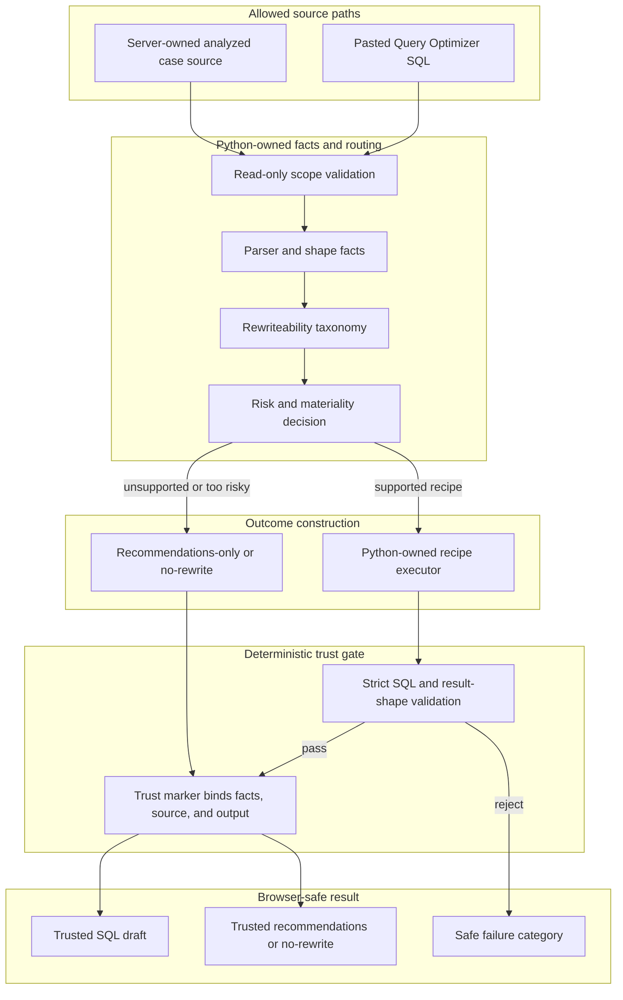

# Query Optimizer Contract

Last reviewed: 2026-09-14

This document is the active contract for both optimizer surfaces:

- Query Optimizer: pasted-SQL parse/analyze workflow.
- Query LLM optimizer: explicit details-page action for server-owned analyzed
  cases.

It defines trust boundaries. It is not a roadmap or model bake-off log.

## Shared Safety Rules

- Query Doctor never executes optimizer input SQL.
- Pasted SQL must not be echoed back after submit.
- Browser-visible output must not expose raw source SQL, raw profiles, raw
  metadata, local paths, `case_dir`, subprocess output, secrets, model/runtime
  internals, or raw artifact filenames.
- Python owns facts, source extraction, validation, trust markers, risk
  classification, and allowed recommendation targets.
- LLM output is never trusted because of prompt instructions alone.
- Unsupported or risky rewrites should become trusted `no_rewrite` or
  recommendations-only outcomes, not browser-visible partial drafts.

## LLM Role

The optimizer route is not an LLM SQL-writer contract.

- Trusted SQL drafts are produced by Python-owned deterministic executors for
  supported recipes and accepted only after deterministic validation.
- If a supported recipe is detected but the Python-owned deterministic executor
  cannot construct a draft for the exact query shape, the optimizer records a
  trusted `no_rewrite` outcome with safe guidance instead of asking the LLM for
  a SQL draft.
- The LLM may produce recommendation wording, explanation wording, and
  engineering-review hints from validated facts.
- The LLM must not be the source of a trusted SQL draft. If model text contains
  SQL, it remains untrusted unless the supported Python-owned recipe and
  validator prove the same bounded transform.
- Unsupported SQL shapes should not be sent through a free-form SQL rewrite
  path. They should become trusted `no_rewrite` or recommendations-only
  outcomes.

## Optimizer Trust Flow

This diagram shows the trust boundary. Recipe-specific rules below remain the
source of detail for what a Python-owned executor may construct and validate.

## Pasted-SQL Query Optimizer

Input:

- exactly one safe `SELECT` or `WITH` statement;
- no DML, DDL, admin commands, multi-statement input, or query execution.

Processing:

- validate SQL before referenced-table extraction;
- extract referenced physical tables deterministically;
- optionally collect bounded read-only metadata for those tables only;
- return deterministic findings, limitations, and next checks.

Trusted browser output:

- referenced table names;
- metadata collection status;
- deterministic optimizer findings and limitations.

Forbidden browser output:

- submitted SQL text after POST;
- raw metadata output;
- local collection paths or generated artifact filenames;
- parser/runtime internals or subprocess output.

## Details-Page Query LLM Optimizer

Input:

- a server-owned analyzed case;
- source SQL resolved only from allowed case sources;
- source may be a read-only `SELECT` / `WITH` statement or a SELECT/WITH payload
  extracted from supported `INSERT ... SELECT` or `CREATE TABLE AS SELECT`.

Execution:

- only by explicit user action from a details page;
- no automatic execution from Recent queries, Running now, or Known Query ID
  scans;
- no SQL execution against Impala or any other engine;
- recommendations-only LLM prompts stay raw-free and use only Python-owned
  candidates, SQL-shape digests, and optimizer fact digests; an explicit rewrite
  attempt may send source SQL only inside the delimited `INPUT SQL` block, and
  browser output gets only validated trusted results;
- externally pasted rewrite candidates are validated in memory only, never
  executed, never persisted as raw artifacts, and never echoed back into browser
  output.

Allowed trusted result:

- one read-only `SELECT` or `WITH` draft when the current web source policy is
  `source_visibility=owner_raw`; or
- a recommendations-only / no-rewrite outcome when Python decides a trusted SQL
  draft is disallowed by source policy, too risky, too unsupported, too long,
  or not materially useful.

Rejected or unsafe result:

- partial draft is hidden;
- raw LLM output is hidden;
- validation failure produces safe status text, not raw draft text or raw
  subprocess output;
- externally pasted validation candidates produce safe pass/fail categories
  only.

## Draft Validation

The trusted SQL path must reject:

- non-SELECT/WITH output;
- multiple statements;
- mutating/admin SQL;
- added physical tables;
- removed `WHERE`, `HAVING`, or `LIMIT` scope;
- changed `DISTINCT`;
- changed top-level `WHERE`, `GROUP`, `HAVING`, `ORDER`, or `LIMIT`
  expression signatures;
- changed top-level `JOIN ... ON` condition signatures;
- changed top-level set-operation, CTE, or JOIN shape;
- changed output projection count or known output names;
- changed output projection expression signatures;
- SQL outside the supported optimizer parser scope.

Validation is conservative and signature-based. It intentionally rejects
safe-looking rewrites unless Python owns the safe transform.
When no Python-owned recipe exists, the optimizer must not ask the LLM for a
SQL draft; it should produce a trusted `no_rewrite` outcome with deterministic
guidance instead. That guidance must make the no-draft boundary explicit and
include a verification path, such as EXPLAIN comparison and a comparable rerun,
before claiming benefit from any manual change.

No-recipe guidance may identify raw-free SQL shape families such as filtered
scalar aggregate review, broader plain aggregate or distinct review,
grouped aggregate review, distinct aggregate review, scalar aggregate review,
set-operation branch review, set-operation research, nested-query boundary,
join review, single-relation filter review, CTE boundary, or derived-table
boundary. Aggregate labels may describe only safe categories such as grouping
grain, duplicate semantics, aggregate input rows, filter selectivity,
partition pruning, stats freshness, or projection width. Set-operation branch
labels may describe only safe categories such as
projection boundary, projection mismatch, nested branch boundary, aggregate
branch boundary, join-heavy branch, filtered/unfiltered branch review, or mixed
or distinct set-operation boundary. These labels are manual review directions
only. They must not expose SQL text, identifiers, predicates, literals, paths,
artifacts, model internals, or imply that a trusted SQL draft exists.

Recent scan summaries may persist the same boundary as an allowlisted
`no_recipe_review_track` token. This token is telemetry and backlog routing
only; it is not recipe detection, draft eligibility, or proof of benefit.
Browser presenters may render only allowlisted human-readable labels for these
tokens and may derive only allowlisted review areas or first-change directions
from them. Details action cards and Workload Action Queue may also derive
allowlisted verification wording or comparison metrics from specific review
tracks, but they must not infer those from raw SQL, identifiers, artifacts, or
free-form model text. Workload Action Queue may aggregate repeated rows by
those allowlisted labels only. Unknown tokens must not be shown as sanitized
free text or affect visible review guidance.

Representative no-recipe calibration should run
`scripts/audit_optimizer_funnel.py <batch_summary.json> --fail-on-repeated-no-recipe-readiness-gaps`.
In strict mode, repeated no-recipe workload groups must resolve to one safe
review track, an allowlisted review area, a bounded change direction, a workload
metric, and compare/rerun verification wording before they count as ready for
guidance or recipe-backlog decisions. Retained candidate reasons must also stay
raw-free; raw-like candidate text is a readiness blocker even when audit output
collapses it to a safe aggregate counter. Add
`--summary-json <raw-free-optimizer-funnel-summary.json>` when retained machine
evidence is needed; the JSON summary must contain only aggregate counters,
safe issue categories, and masked workload labels.

## Shape Facts

Shape facts are deterministic, raw-free categories. Browser-visible summaries
may show counts and labels, but not CTE names, branch SQL, predicates, source
paths, or parser artifacts.

- CTE `UNION ALL` branch-filter facts may expose only the branch count and one
  of: candidate for all branches, candidate for a single branch, ambiguous
  branch lineage, unsupported branch projection, no filtered union output, no
  final filter, or no `UNION ALL`.
- These facts are discovery and ranking inputs. They authorize a SQL draft only
  for the exact `cte_union_branch_filter_pushdown` shape described below; all
  other branch-filter categories remain triage context until a Python-owned
  recipe and validator prove the transform.

## Recipe-Backed Exceptions

Recipe exceptions are allowed only when recipe-specific validation proves the
boundary.

- `post_union_aggregate_pushdown`: accepts CTE body changes for detected
  `UNION ALL` detail CTEs followed by downstream aggregation. Narrow
  deterministic execution is allowed when every branch has simple named
  projections and the downstream aggregate expressions can be mapped back to
  those branch projections. Validation must preserve physical table set,
  source filters, join predicates, literals, final output shape, CTE names,
  branch count, and aggregate rollup shape.
- `final_union_distinct_rollup`: accepts CTE body changes for detected
  `UNION ALL` detail CTEs feeding a final `COUNT(DISTINCT ...)` aggregate.
  Narrow deterministic execution is allowed when branch projections can be
  mapped to the CTE output order and additive final aggregate inputs can be
  pre-aggregated in each branch. Validation must preserve the final aggregate
  query and pre-aggregate branches to the CTE output grain plus distinct keys.
- `cte_union_branch_filter_pushdown`: accepts copied final `WHERE` predicates
  inside a single `UNION ALL` CTE when the final SELECT reads that CTE directly
  and the filtered output columns map to simple branch columns. Deterministic
  execution keeps the final `WHERE` predicate in place, copies only eligible
  top-level conjuncts into eligible branch `WHERE` clauses, leaves branches
  with unsupported filtered-column projections unchanged, and rejects CTE
  column lists, final SELECT joins, branch joins, aggregates, DISTINCT,
  ordering, limits, or nested set operations. Validation must preserve the CTE
  name, branch count/order, `UNION ALL` operators, physical table set,
  projections, literals, all original branch filters, and final SELECT shape;
  added branch predicates must be copied from the final SELECT through simple
  branch projection mapping.
- `pass_through_cte_elimination`: accepts removing one single-use pass-through
  CTE when it only selects simple columns from exactly one upstream CTE and is
  consumed directly by the final SELECT. Detection and deterministic execution
  require no filters, joins, aggregates, set operations, DISTINCT, ORDER BY, or
  LIMIT in the removed CTE, no final SELECT joins or set operations, and no
  final qualifier references to the removed CTE. Validation must preserve every
  remaining CTE body, physical table set, final output shape, filters, literals,
  and final SELECT expressions.
- `single_cte_predicate_pushdown`: accepts copied WHERE predicates inside a
  single CTE consumed by the final SELECT. Detection and deterministic
  execution require a copyable downstream predicate that targets the CTE
  output, not another joined relation. Validation must preserve the CTE name,
  final CTE reference, physical table set, projections, joins, literals, all
  original filters, and final output shape; added predicates must already exist
  in the final SELECT or as a CTE-alias-qualified downstream equivalent.
- `single_cte_projection_alias_predicate_pushdown`: accepts copied WHERE
  predicates inside a single CTE consumed by the final SELECT when a downstream
  predicate targets a CTE output alias that maps to exactly one unqualified
  source column in the CTE projection. Detection and deterministic execution
  reject functions, casts, arithmetic, aggregates, windows, subqueries,
  qualified source expressions, grouped CTEs, joins, and CTE column lists.
  Validation must preserve the CTE name, final CTE reference, physical table
  set, projections, joins, literals, all original filters, and final output
  shape; added predicates must be the downstream predicate with that output
  alias replaced by the exact projected source column.
- `single_derived_table_predicate_pushdown`: accepts copied WHERE predicates
  inside one top-level derived table consumed by the outer SELECT. Detection
  and deterministic execution require a copyable outer predicate that targets
  the derived-table output, simple projection preservation, and no joins,
  aggregates, set operations, window functions, DISTINCT, ORDER BY, or LIMIT in
  the derived table body. Validation must preserve the derived-table alias,
  physical table set, projections, joins, literals, all original filters, and
  outer output shape; added predicates must already exist in the outer SELECT
  or as a derived-alias-qualified equivalent.
- `single_derived_table_projection_alias_predicate_pushdown`: accepts copied
  WHERE predicates inside one top-level derived table when an outer predicate
  targets a derived-table output alias that maps to exactly one unqualified
  source column in the derived-table projection. Detection and deterministic
  execution reject functions, casts, arithmetic, aggregates, windows,
  subqueries, qualified source expressions, joins, set operations, DISTINCT,
  ORDER BY, and LIMIT. Validation must preserve the derived-table alias,
  physical table set, projections, joins, literals, all original filters, and
  outer output shape; added predicates must be the outer predicate with that
  output alias replaced by the exact projected source column.
- `linear_cte_predicate_pushdown`: accepts copied WHERE predicates earlier in a
  single-chain CTE graph. Narrow deterministic execution is allowed when each
  CTE in the chain preserves simple projected columns and a final SELECT
  predicate references columns preserved by every CTE in the chain. Validation
  must preserve CTE order, dependency edges, physical table set, projections,
  joins, literals, all original filters, and final output shape; added
  predicates must already exist downstream.
- `cte_dag_predicate_pushdown`: accepts copied WHERE predicates earlier in an
  acyclic fan-out/fan-in or UNION-assembly CTE graph. Narrow deterministic
  execution is allowed when a final SELECT predicate can be traced through
  simple projections and UNION branches to one leaf CTE output column.
  Validation must preserve CTE order, dependency edges, UNION branch shape,
  physical table set, projections, joins, literals, all original filters, and
  final output shape; added predicates must already exist downstream on the
  same dependency path.
- Recipe WHERE validation compares `UNION ALL` branches independently and
  allows only added transitive `BETWEEN` filters proven from inner-join equality
  predicates in the same branch.
- Per-conjunct predicate-pushdown contract: for all predicate-pushdown recipes,
  top-level `AND` conjuncts are evaluated independently. A conjunct may be
  copied only if it dequalifies entirely against the target CTE or derived-table
  aliases and projected columns. Conjuncts that reference foreign aliases or
  unavailable columns must remain only in the downstream `WHERE`. Parenthesized
  `AND` groups are decomposed only when the parentheses enclose the whole group;
  other parenthesized expressions remain atomic. The downstream `WHERE` must not
  be removed, weakened, or rewritten.

Add new recipes only with focused fixtures and validation tests.

## CTE Shape Facts

CTE shape analysis is an analyzer-owned support layer for recipe detection and
Recent scan labels. It may record safe categories and counts only:

- graph category such as single CTE, linear chain, CTE DAG, disconnected, or
  unsupported reference order;
- dependency edge count, final-reference count, max consumer count, and
  single-use/pass-through counts;
- predicate-pushdown eligibility such as candidate, no downstream filter, or
  unsupported graph;
- predicate-origin category such as final SELECT filter, downstream CTE filter,
  mixed downstream filters, or no downstream filter;
- predicate-path category such as single dependency path, DAG dependency path,
  mixed dependency paths, or unsupported dependency path;
- projection-contract category such as named, partial, or unknown projection
  contract;
- projection-preservation category and counts for simple projections,
  named-expression projections, or unknown projection preservation;
- simplification eligibility such as pass-through candidate or single-use
  candidate;
- boundary categories such as aggregate, set operation, window, outer join,
  multi-consumer, fan-in, and CTE-body-validation-not-proven.

These facts must not expose raw SQL fragments, raw CTE names, local paths, or
artifact filenames in browser-visible output. Simplification facts are not SQL
equivalence proof by themselves: pass-through elimination is trusted only for
the dedicated recipe above, and broader CTE inlining still needs its own
recipe-specific validation before a trusted draft can use it.

Recent scan may label a recipe as SQL-draft-ready only after the corresponding
Python-owned deterministic executor can construct a material draft in memory and
that draft passes recipe validation. Recipe detection without a constructible
validated draft must remain draft-unavailable or recommendations-only context,
not `safe_to_attempt`.

## Derived Table Shape Facts

Derived-table shape analysis is an analyzer-owned support layer for the narrow
derived-table predicate-pushdown recipe. It may record safe categories and
counts only:

- derived-table count;
- predicate-pushdown eligibility such as candidate, no downstream filter, or
  unsupported shape;
- predicate-origin category such as outer SELECT filter or no downstream
  filter;
- projection-preservation category such as simple projections, named
  expression projections, or unknown projection preservation;
- boundary categories such as nested-body validation required, outer
  join/multiple relations, aggregate, set operation, window, DISTINCT,
  ORDER/LIMIT, outer join, or non-simple projection.

These facts must not expose raw SQL fragments, derived-table aliases, local
paths, or artifact filenames in browser-visible output.

## Trust Marker

The details-page optimized draft is trusted only when all of these are true:

- draft file exists under the server-owned case directory;
- deterministic facts file exists under the same case directory;
- validation marker has the current schema version and strict validation mode;
- marker identifies the expected draft file;
- marker draft hash matches the current draft file;
- marker facts hash matches the current deterministic facts file;
- marker source SQL hash and source scope match the current extracted source;
- current draft still parses as supported read-only SELECT/WITH SQL.

Legacy or minimal optimizer markers are not trusted.

For trusted non-SQL outcomes, the marker must bind the same facts/source scope
and identify the outcome kind. Stale SQL draft artifacts must not be treated as
trusted under recommendations-only or no-rewrite markers.

## Fallback Policy

Current behavior:

- low-risk case, `source_visibility=owner_raw`, and validator passes: show
  validated optimized draft;
- default `source_visibility=safe`: show no SQL draft and provide trusted
  recommendations-only fallback, even if a validated draft artifact exists from
  an earlier owner-raw session;
- high-risk case: show no trusted SQL draft and provide deterministic
  recommendations-only fallback;
- no-benefit case: show no trusted SQL draft and provide a `no_rewrite` outcome;
- output-budget truncation: show no trusted SQL draft and provide trusted
  `no_rewrite`;
- completed draft rejected by validation: show no trusted SQL draft and provide
  trusted no-rewrite or recommendations when Python can explain the rejection
  safely;
- Details-page optimizer action: hide or disable the launch action when
  deterministic rewrite-support classification is not `safe_to_attempt`; show a
  browser-safe reason such as manual review only, safety-threshold guardrail, no
  recipe, deterministic draft unavailable, source unavailable, or not
  applicable;
- no-draft recommendations must be useful enough for manual review: state that
  no trusted SQL draft is shown, identify the safe review direction from
  Python-owned facts, optionally include a raw-free no-recipe shape family, and
  require EXPLAIN comparison plus comparable rerun validation before any
  benefit claim;
- always hide partial drafts and raw LLM output;
- manual rewrite guidance may appear only when it is Python-owned and browser
  safe;
- external rewrite validation returns only safe categories such as read-only
  scope passed, table set changed, filter scope changed, JOIN conditions
  changed, projection changed, incomplete SQL, or no material rewrite.

## Browser Display Rules

Details may show safe optimizer status fields:

- source scope category, such as read-only statement, INSERT payload, or CTAS
  payload;
- risk mode, such as rewrite allowed or conservative;
- human-readable deterministic guardrail reasons, such as CTE body equivalence
  not being proven or SQL shape exceeding safe draft thresholds;
- validation outcome category;
- trusted output kind, such as SQL draft, recommendations-only, or no-rewrite.

Details must not show:

- source SQL unless it is the trusted validated draft itself and the current
  source policy is `source_visibility=owner_raw`;
- partial draft;
- raw LLM text;
- local paths;
- generated artifact filenames;
- model/runtime internals;
- subprocess output.

## Current Limitations

- Query Doctor diagnoses expensive Impala query behavior first. SQL rewrite is
  a narrow validated outcome, not the primary product value.
- This is not a general SQL equivalence engine.
- Recipe coverage is intentionally narrow.
- Broad real-workload `safe_to_attempt` rates may be low because expensive SQL
  is often not safely rewriteable under the current Python-owned recipe
  contract. Treat that as recipe coverage data, not automatically as a model
  regression.
- Local model quality does not predict optimizer rewrite quality; use optimizer
  bake-off fixtures before changing model defaults.
- Many safe product outcomes will be recommendations-only or no-rewrite until
  more Python-owned recipes exist.
- `tests/fixtures/optimizer_cases/` is a baseline corpus, not complete coverage.

## Test Obligations

Optimizer changes should include focused tests for the touched boundary:

- marker schema/mode/hash/source binding;
- stale draft, changed facts, and changed source invalidating trust;
- predicate weakening and changed predicate literals;
- changed `JOIN ... ON` conditions;
- changed output expression semantics with unchanged aliases;
- recipe-specific accepted and rejected shapes;
- stale SQL cleanup for non-SQL outcomes;
- recommendation text safety in writer and web-load paths;
- no browser echo after Query Optimizer POST;
- hidden partial drafts and safe failure messages.

For model or prompt changes, also run repeatable fixture bake-offs with
`scripts/compare_optimizer_models.py --fixture-corpus`.
